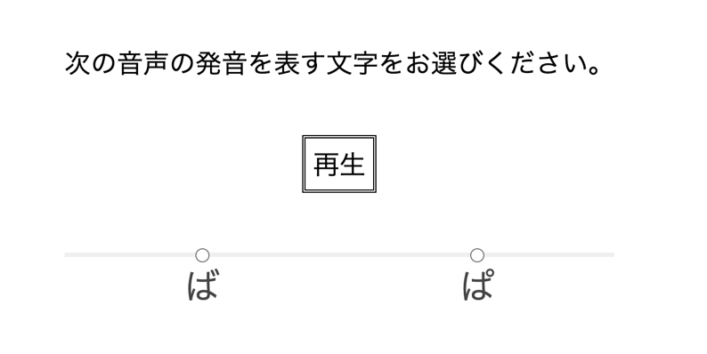

# 恒常法を用いた聴覚刺激の弁別課題

この実験では参加者に音声ファイルを聞かせて、それが「ば（ba）」と聞こえたか「ぱ（pa）」と聞こえたかを判断させます。

実験を始めると下のような画面が表示されます。


「再生」ボタンをクリックすると音声刺激が呈示されます。音声刺激は一度だけ聞くことができます。再生後、画面下部の「次へ」ボタンを押してください。

音声刺激は全部で24種類あり、0から23の番号が割り振られています。
それぞれの刺激は、破裂開始から声帯振動開始までの時間の長さである Voice Onset Time (VOT; Lisker & Abramson, 1964) が異なります。0 は VOT = -30 ms の刺激で、刺激番号が 1 増えるごとに刺激のVOTは 5 ms 長くなります。以下の表をご参照ください。

|ファイル番号|VOT (ms)|
|---|---|
|0|-30|
|1|-25|
|2|-20|
|（中略）|（中略）|
|20|70|
|21|75|
|22|80|
|23|85|

負の（マイナスの）VOTは、破裂の開始より声帯振動が先に起こっていることを示しています。

実験刺激である音声ファイルは、Praat (Boersma & Weenink, 2019) を用いて作成しました。また、VOTの操作は、[Dr. Jessamyn Schertz が公開している Synthesis -> klatt_synthesize_vot_f0_series.praat のスクリプト](http://individual.utoronto.ca/jschertz/scripts.shtml)を使って行いました。

音声の長さは319 msです。母音部の始端部と終端部の基本周波数 (F0) は100 Hzです。

最初の24試行は練習試行で、すべての刺激を1回ずつ聞くことになります。

その後本試行が始まります。以下のリンクの本試行ではそれぞれの刺激が5回ずつ呈示されます。全部で120試行です（練習試行を含まない）。24試行ごとに休憩のためのメッセージが呈示されます。

## 結果の予測

Shimizu (1977) によれば、日本語母語話者の「ば（ba）」と「ぱ（pa）」の弁別の境界は、VOT = 18 ms です。VOTが正の方向に大きいほど「ぱ（pa）」と聞こえる割合が高くなると予測されます。

## 実験を始める

反応時のキーのカウンターバランスをとるようにしています。

- [左側の選択肢が「ば (ba)」で右側の選択肢が「ぱ (pa)」](constant_method.html?counterBalance=1&repeat_num=5)
- [左側の選択肢が「ぱ (pa)」で右側の選択肢が「ば (ba)」](constant_method.html?counterBalance=2&repeat_num=5)

本試行の繰り返し回数は次のようにして変更することが可能です。
実験画面のURLを見ると、

```
constant_method.html?counterBalance=1&repeat_num=5
```

のようになっているかと思いますが、repeat_num の後の数字（5）が本試行の繰り返し回数です。

## 出⼒ファイルについて

実験が終了したときにCSVファイルとして保存されます。ブラウザによって自動保存されたり、保存のための小さなウィンドウが表示されたりします。

実験プログラムは[jsPsych](https://www.jspsych.org/)を使って作成されています。その関係で、分析とは直接関係のないデータも出力されています。

各列については次の通りです。

- rt（A列）　反応時間（ms）
- button_pressed（B列）からquestion_order（I列）までは無視
- stimuli_info（J列）　呈示された音声刺激の番号
- counterBalance_info（K列）1のとき 左側の選択肢が「ば (ba)」　右側の選択肢が「ぱ (pa)」2のとき 左側の選択肢が「ぱ (pa)」　右側の選択肢が「ば (ba)」	
- phase_info（L列）　0=練習試行, 1=本試行
- resp（M列）　「ば (ba)」を選んだら1, 「ぱ (pa)」を選んだら0（カウンターバランスは考慮済み）

**エクセルのフィルター機能を使って、phase_info = 1 のデータだけを抽出すると分析がしやすいです。**

## 閾値に関する注意点

エクセルやRを使って、横軸をVOT、縦軸を「ば（ba）」と答えた割合とした心理物理関数を作成してください。5回の繰り返し回数では少ないかもしれませんが、オンライン実験では試行数を多くしすぎると別の問題（集中力の低下、マジメに参加しないなど）が生じる恐れがあります。なお、ここでは閾値を求めるためのスクリプトは公開しておりません。ご了承ください。

# 引用文献
- Boersma, P., & Weenink, D. (2019). Praat: Doing phonetics by computer (Version 6.1.03) [Computer software]. http://www.praat.org/
- de Leeuw, J. R. (2015). jsPsych: A JavaScript library for creating behavioral experiments in a web browser. Behavior Research Methods, 47(1), 1-12. doi:10.3758/s13428-014-0458-y.
- Lisker, L., & Abramson, A. S. (1964). A cross-language study of voicing in initial stops: Acoustical measurements. Word, 20, 384–422.
- Shimizu, K. (1977). Voicing features in the perception and production of stop consonants by Japanese speakers. Studia Phonologica, 11, 25–34.
