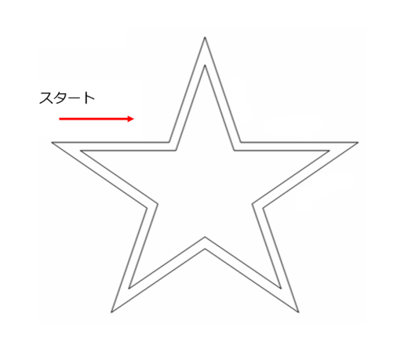
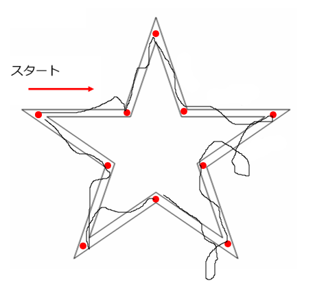

# 鏡映描写

## 実験の目的

鏡映描写の課題を通じて、両側性転移が生じるかどうかを確認します。この実験における両側性転移とは、**非利き手**の練習効果が**利き手**の課題遂行に影響を及ぼすことを意味します。

## 実験の手続き

次の３条件を設けています。

| | 前テスト（2回） | 練習（10回） | 後テスト（2回） |
----|----|----|---- 
| 第1群 | 利き手 | 利き手 | 利き手 |
| 第2群 | 利き手 | 非利き手 | 利き手 |
| 第3群 | 利き手 | 休憩（10分） | 利き手 |

この実験では、マウスまたはタッチパッドを使用して星形をなぞります。（スマートフォンやタブレット端末には非対応）。マウスを上（下）に移動させると画面上の線が下（上）方向に描画されます。左右の反転はありません。

星形をなぞるときは、必ず左上から開始します。左上をクリックすると赤い丸がつきます。星の角に到達すると赤丸がつきます。必ず通過しなくてはいけないチェックポイントのようなものです。

全部の角に順番に印がついて、最初の地点に戻ると画面がクリアされて、同時に画像ファイルが出力されます。画像ファイルは、EdgeとChromeでは自動的にダウンロードされます（他のブラウザは未確認です）。実験が終わったあとに、各画像を見て、輪郭から逸脱した回数を数えます。（手動です、ごめんなさい）

課題の遂行に要した時間は自動で記録されます。



<div style="text-align: center; margin-bottom: 40px">図1. 試行開始時の状態</div>
 


<div style="text-align: center; margin-bottom: 40px">図2. 各試行後に保存される画像の例</div>

## 星形のなぞりかた

次の２種類があります。

- 方法１：クリックした状態のままで星形をなぞる
- 方法２：クリックして、指をあげてから星形をなぞる

### 方法１の注意点

星形をなぞっているあいだは、カーソルは表示されません。
輪郭をなぞっている途中でクリックを解除したときには、いったんカーソルをスタートしたい位置まで動かして再開してください。

## 実験へのリンク

### 方法１：クリックした状態のままで星形をなぞる

- [第1群](MirrorDrawing.html?pattern=1&mouse_style=1)
- [第2群](MirrorDrawing.html?pattern=2&mouse_style=1)
- [第3群](MirrorDrawing.html?pattern=3&mouse_style=1&rest_time=10)

### 方法２：クリックして、指をあげてから星形をなぞる

- [第1群](MirrorDrawing.html?pattern=1&mouse_style=2)
- [第2群](MirrorDrawing.html?pattern=2&mouse_style=2)
- [第3群](MirrorDrawing.html?pattern=3&mouse_style=2&rest_time=10)

## 出⼒ファイルについて

実験が終了したときにCSVファイルとして保存されます。ブラウザによって自動保存されたり、保存のための小さなウィンドウが表示されたりします。

実験プログラムは[jsPsych](https://www.jspsych.org/)を使って作成されています。その関係で、分析とは直接関係のないデータも出力されています。

各列については次の通りです。

- A列（rt）: jsPsychがデフォルトで出力する反応時間ですが、鏡映描写の反応時間ではないので注意してください。
- B列（button_pressed）: 無視
- C列（phase）　1と2は教示、3は鏡映描写の課題、4は第3群の休憩を意味します。
- D列（trial_type）とE列（trial_index）は無視
- F列（time_elapsed）:　実験を開始したときからの経過時間（ms）
- G列（internal_node_id）:　無視
- H列（date）:　実験を行った日時
- I列（randomID）:　参加者ごとに割り当てられたランダムな文字列
- J列（pattern）:　実験の３条件を表しています。
- K列（success）:　trueのときは使用したブラウザがフルスクリーンモードをサポートしていることを意味します
- L列（reaction_time）:　この反応時間が適切な反応時間です。最初の赤丸がついたときを開始時間として、最後の赤丸がつくまでの時間を秒単位で表示します。課題遂行に要した時間です。
- M列（trial_num）:　試行の番号
- N列以降は無視

Excelのフィルター機能を使って、phase=3のデータを抽出してreaction_timeを参照すると分析に必要なデータを得ることができると思います。

# 休憩時間の変更方法

第3群の休憩時間はデフォルトでは10分ですが、これは簡単に変更することができます。

実験画面のURLを見ると、

```
MirrorDrawing.html?pattern=3&mouse_style=2&rest_time=10
```

のようになっているかと思いますが、rest_timeの後の数字を分単位で指定してください。


# 引用文献
- de Leeuw, J. R. (2015). jsPsych: A JavaScript library for creating behavioral experiments in a web browser. Behavior Research Methods, 47(1), 1-12. doi:10.3758/s13428-014-0458-y.
- Kuroki, D. A new jsPsych plugin for psychophysics, providing accurate display duration and stimulus onset asynchrony. Behav Res (2020). https://doi.org/10.3758/s13428-020-01445-w
